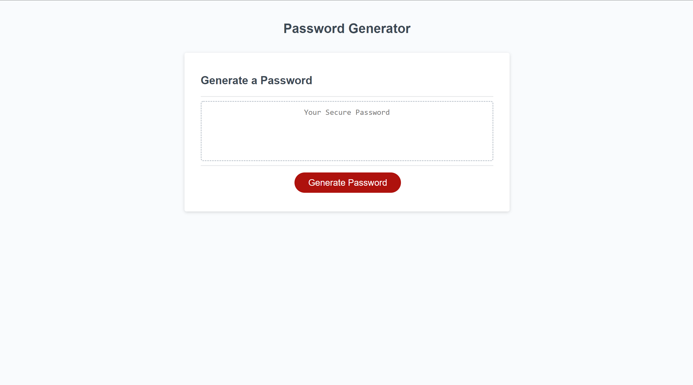

# Password Generator

## Webpage description

I edited the Javascript on this page to create a working password generator that would take in criteria such as password length and character type. Then return it on the screen.

I originally did it by shuffling all chosen characters and shuffling then splicing the requested length but it couldn't make a password longer than the amount of characters in the arrays. eg couldn't do more than 10 numbers

## Features

1. will alert your password is too long or too short
2. will alert you if you don't choose character types

# link to page

<a href ="https://jgood13.github.io/passwordgen/"
target="_blank"> Deployed Webpage</a>

## screenshot

## credits

1. <a href="https://javascript.info/task/shuffle" target="_blank">javascript.info,</a>
2. <a href="https://www.w3schools.com/js/js_loop_for.asp" target="_blank">w3schools,</a>